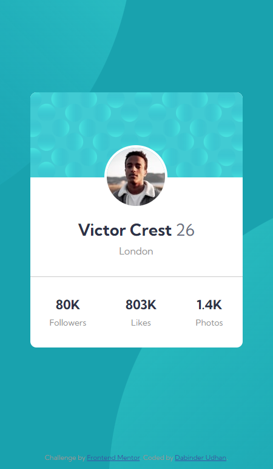
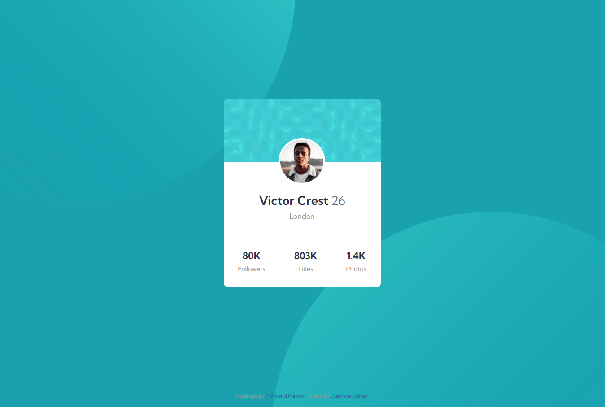

# Frontend Mentor - Profile card component solution

This is a solution to the [Profile card component challenge on Frontend Mentor](https://www.frontendmentor.io/challenges/profile-card-component-cfArpWshJ). Frontend Mentor challenges help you improve your coding skills by building realistic projects.

## Table of contents

- [Overview](#overview)
  - [The challenge](#the-challenge)
  - [Screenshot](#screenshot)
  - [Links](#links)
- [My process](#my-process)
  - [Built with](#built-with)
  - [What I learned](#what-i-learned)
  - [Continued development](#continued-development)
  - [Useful resources](#useful-resources)
- [Author](#author)
- [Acknowledgments](#acknowledgments)

**Note: Delete this note and update the table of contents based on what sections you keep.**

## Overview

### The challenge

- Build out the project to the designs provided

### Screenshot




### Links

- Solution URL: [Github](https://github.com/dabinderudhan/Profile-card-component)
- Live Site URL: [live URL](https://your-live-site-url.com)

## My process

### Built with

- Semantic HTML5 markup
- CSS custom properties
- Flexbox
- Mobile-first workflow
- SASS

### What I learned

with this challenge I learnt the properties of background image

```css
.background-pattern {
  background-image: url("../folder/image2.svg"), url("../folder/image2.svg");
  background-repeat: no-repeat, no-repeat;
  background-position: right 51vw bottom 50vh, left 45vw top 52vh;
}
```

## Author

- Website - [Github profile](https://github.com/dabinderudhan)
- Frontend Mentor - [@dabinderudhan](https://www.frontendmentor.io/profile/dabinderudhan)
- Twitter - [@dabinderudhan](https://twitter.com/dabinderudhan)
